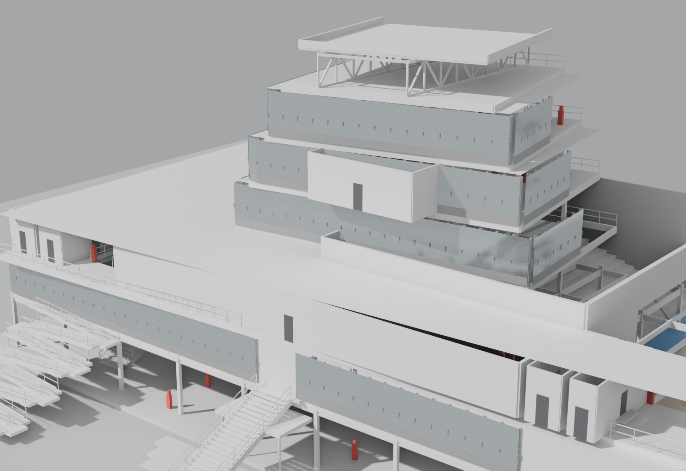

# Music to Architecture

A constraint-aware design-intent compiler that translates music into a traceable
architectural score, then coordinates program, massing, circulation, structure, facade,
interior elements, drawings, and review reports.

> Research status: working local prototype. Generated results remain
> `professional_review_required`; placeholder code and site inputs never become claims of
> compliance, safety, permit readiness, or construction readiness.



## Why this project exists

Music is the memorable stress test. The durable problem is cross-scale design-intent
computation: how one ambiguous intent can travel through several design systems without
being diluted, hidden, or reinterpreted at every handoff.

The project is organized around four abilities defined in the
[Project Charter](PROJECT_CHARTER.md):

- **V1 — Formalize intent:** turn qualitative readings into bounded, inspectable rules.
- **V2 — Coordinate systems:** give program, form, structure, facade, and interior
  different but related interpretations of one score.
- **V3 — Build a reliable workflow:** make inputs, ownership, provenance, regeneration,
  failure containment, and tool boundaries explicit.
- **V4 — Evaluate results:** report architectural, compositional, and pipeline checks
  without hiding failures or unevaluated work.

The current evidence status is recorded in the
[Career Evidence Matrix](docs/evidence_matrix.md).

## Pipeline

```text
MP3
  -> audio features + methods + confidence
  -> ten-dimension Shared Score
  -> score-led type / form / style / structure selection
  -> datums + registration lattice
  -> program allocation + member-level building model
  -> sizing, facade, circulation, dependency, site, and drawing reports
  -> Blender GLB + frozen web workbench
  -> Grasshopper/Rhino review and accepted-state route
  -> proposed Revit/Dynamo BIM translation and reconciliation route
```

Two contracts run in parallel:

- `backend/app/compiler.py` owns the v2 massing contract used by the Grasshopper watcher,
  facade handoff, and acceptance manifest.
- `backend/app/compiler_v3.py` owns the member-level model drawn by Blender and the web
  viewport.

A v3 failure does not block or overwrite the v2 acceptance chain. `backend/app/pipeline.py`
is the shared run definition used by the API and frozen-demo generator.

## Design-to-BIM handoff

The proposed Revit/Dynamo route addresses the seam between regenerable design geometry
and an editable BIM model. It defines stable source identity, reviewed native-category
mapping, labeled DirectShape fallbacks, explicit metre/coordinate conversion,
create/update/keep/conflict/retire behavior, and rollback/reconciliation evidence.

Current status is intentionally narrow:

| Prepared and checked | Still requires a live Revit/Dynamo proof |
|---|---|
| 70/70 schema 3.0 element kinds have one mapping strategy | Installed Revit/Dynamo/package version matrix |
| 18 shared instance parameters have stable GUIDs | Reviewed family/type and template mapping |
| Cross-tool ID, host binding, conflict, and no-hard-delete rules | `.dyn` graph, `.rvt` result, rerun and rollback evidence |
| Four-run validation experiment and evidence package are specified | Native-element, DirectShape, schedule, and review-queue results |

See the [Revit/Dynamo handoff guide](docs/revit_dynamo_handoff.md) and
[Decision 0011](docs/decisions/0011-revit-dynamo-bim-handoff.md). Until the live proof
passes, the project claims handoff readiness and contract coverage, not completed BIM
integration or construction readiness.

The frozen demo exposes the same run-level report in **Reports → BIM handoff**. The
[visual evidence package](artifacts/evidence/revit_dynamo_handoff_ui/README.md) records
the UI capture, its source metrics, verification steps, and screenshot hash.

## Quick start

Tested locally with Python 3.11 and Node.js 22 or newer on Windows. Blender is optional
for backend tests and required for native `.blend`, GLB, and render generation.

From the repository root:

```powershell
python -m venv .venv
.\.venv\Scripts\python.exe -m pip install -r backend\requirements.txt
.\.venv\Scripts\python.exe -m uvicorn backend.app.main:app --reload --port 8000
```

In a second terminal:

```powershell
Set-Location web
npm ci
npm run dev
```

Open `http://localhost:3000`. The page starts with a real frozen run, so its model,
drawings, renders, and reports are available before an MP3 is uploaded. Live API runs are
stored locally under `artifacts/web_runs/`.

## Workbench

The default view is the building, in a cyanotype blueprint mode (a light Studio mode
is one click away). Opening a run plays a narrated build: the model assembles in
construction order while a plain-language rationale feed streams what was measured,
chosen and checked — every line filled from the run itself. Leader-line callouts
annotate the finished model, corner HUD readouts track its state, and switching runs
holds the camera still and re-assembles only what changed, so two compilations of the
same piece can be compared from one viewpoint. Layers and the section plane float over
the viewport; reports open in one drawer.

| Group | Panels |
|---|---|
| Run | Overview and run identity |
| Music | Audio features, Shared Score, datums, mappings, translation health, selection |
| Building | Drawings, structure and sizing, program allocation |
| Evidence | Compliance roll-up, site values, load cases, limitations |
| Diagnostics | Dependency graph, axis checks, manifests, hashes, downloads |

The API exposes the complete run at `POST /api/generate`, stored runs at `/api/runs`,
and generated drawings and renders under `/api/models/{model_id}/...`.

## Repository map

| Path | Contents |
|---|---|
| [`backend/`](backend/) | Portable compiler, API, validators, scripts, and Python tests |
| [`web/`](web/) | React/Three.js workbench and its frozen public demo |
| [`docs/`](docs/) | Decisions, system guides, experiments, workflows, and evidence status |
| [`fixtures/`](fixtures/) | Shared deterministic test and demo inputs |
| [`runtime/`](runtime/) | Ignored local JSON handoff directory |
| [`artifacts/`](artifacts/) | Evidence, experiment reports, and ignored per-run output |
| [`blender/`](blender/) | Blender adapters, examples, prototypes, and ignored generated scenes |
| [`grasshopper/`](grasshopper/) | Modular JSON-watcher and preview definition |
| [`rhino/`](rhino/) | Rhino-owned native example geometry |
| [`portfolio/`](portfolio/) | Journal-style figure set for portfolio and technical review: SVG sources, PNGs, captions, pinned hashes |

More detailed navigation:

- [Portfolio figures](portfolio/README.md)
- [Documentation guide](docs/README.md)
- [Artifact guide](artifacts/README.md)
- [Native modeling workflow](docs/native_model_workflow.md)
- [Revit/Dynamo handoff guide](docs/revit_dynamo_handoff.md)
- [Contributing guide](CONTRIBUTING.md)

## Evidence to inspect first

- [Cross-track style evidence](artifacts/style_evidence/README.md) compares the
  score-selected form, typology, facade grammar, and structural system.
- [Audio calibration experiment](docs/experiments/audio_normalization_calibration.md)
  explains why feature ranges are calibrated and how saturation is checked.
- [Latest dependency corpus](artifacts/audio_saturation/corpus-2026-08-31-dependency-rerun-2/README.md)
  records complete element connection coverage while keeping connection capacity
  explicitly unchecked.
- [Integrated layer evidence](artifacts/evidence/integrated_library_building-b7ad95fa45a6/README.md)
  shows one run with semantic program, facade, structure, and clipping states.
- [Gemini/Lyria smoke test](artifacts/gemini_smoke_test/README.md) records the source
  fixture, hashes, measured outputs, and known tempo-estimation limitation.

## Verify and regenerate

```powershell
.\.venv\Scripts\python.exe -m pytest -q
Set-Location web
npm run build
npm run lint
```

After a payload, datum, drawing, render, or GLB change, regenerate the self-contained web
demo from the repository root:

```powershell
.\.venv\Scripts\python.exe -m backend.scripts.generate_web_demo
.\.venv\Scripts\python.exe -m backend.scripts.publish_model_version --check
```

`web/public/reports/demo_run.json` is generated from the same pipeline used by the API.
The generator writes a candidate; the publisher verifies and archives it before replacing
the stable public aliases. Do not hand-edit the frozen run or copy unrelated research GLBs
into `web/public/`. See [model version storage](artifacts/model_versions/README.md) and
[Decision 0019](docs/decisions/0019-model-version-storage-and-promotion.md).

## Thesis-model quality and fabrication

The member-level compiler includes named furniture subassemblies and measured part
contact checks. An optional diagnostic STL route preserves source IDs, architectural
openings, scale and assembly transforms while reporting disconnected parts and missing
printer inputs. It does **not** yet claim slicer or physical-print verification. See
[the fabrication workflow](docs/fabrication_workflow.md) for commands, negative tests,
implemented scope and production blockers.

## Boundaries

- MP3 input is limited to 30 MB by the API.
- All ten Shared Score dimensions retain extraction method, confidence, and provenance;
  inferred proxies stay labeled as inferred.
- Overall datum coverage and variable datum coverage are separate metrics.
- The program allocator reports unplaced rooms instead of shrinking the brief to fit.
- Only members governed by the implemented load calculation carry calculated sizing and
  utilization; other members state their conventional or unchecked basis.
- Code tables and unresolved site values remain placeholders that require review.
- Blender output is presentation/downstream geometry. Rhino owns accepted geometry and
  drawings after review. Rhino also owns the Revit handoff; a current `.3dm` is published
  only with the matching per-run acceptance manifest.
- Revit/Dynamo currently has a validated mapping and test contract, not a completed live
  integration. Native family/type selection and BIM acceptance remain human-reviewed.

## Publication status

The folder structure, navigation, ignore rules, fixture metadata, contribution guide,
and security notes are prepared for a public repository. The first release is publicly
viewable with all rights reserved; see [LICENSE](LICENSE). Open-source reuse terms and
formal citation metadata can be added later. Release checks are tracked in the
[public release checklist](docs/public_release_checklist.md). The public source is at
[cloudinjun/MusicToArchitecture](https://github.com/cloudinjun/MusicToArchitecture).
