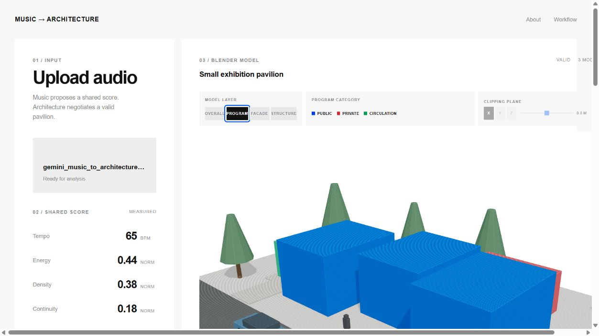
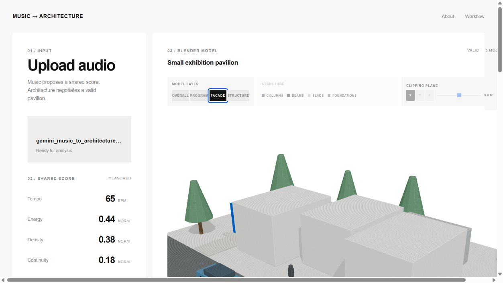
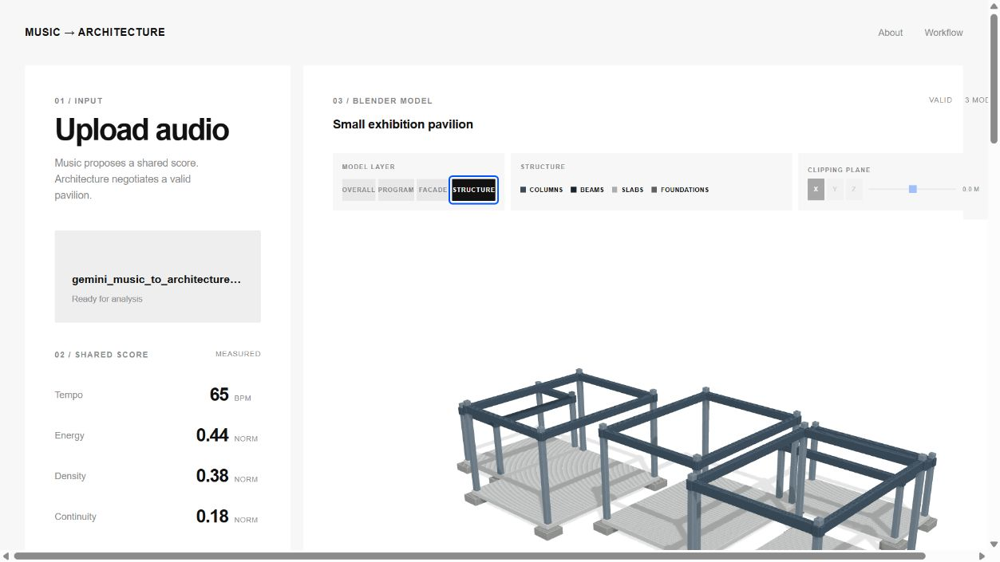

# Semantic Layer Screenshot Evidence

This evidence set records three browser views of one generated Music-to-Architecture run.

## Run identity

- Source audio: `gemini_music_to_architecture_44s.mp3`
- Source-audio SHA-256: `b7ad95fa45a6d546149a4256eb6677ea3f147e0652151d6a0b783846a8695d39`
- Model ID: `building-b7ad95fa45a6`
- GLB: `building-b7ad95fa45a6.glb`
- GLB SHA-256: `9cdb92e98d19b6a7430ccbd05ca470e3a3570105c42e5c8a733a90e54e6bae89`
- Generation status shown in the UI: `VALID`
- Shared Score traceability shown in the UI: `17/17`, `100%`

## Capture protocol

- All three screenshots were captured from the same loaded GLB in one browser session.
- The Three.js camera and orbit controls were left unchanged between captures.
- The clipping plane remained off.
- Only the active `MODEL LAYER` button changed between captures.
- The active button is visible in every screenshot.

## Views

### Program

- Public, private, and circulation program masses are color coded.
- SHA-256: `f0ec88164f2d202f3c56f6b4243364ef49bc27980ff9e6a433f7748a278b726a`

### Facade

- Facade and roof objects are isolated with presentation site context.
- SHA-256: `1f2923480d0c6f260eaa53f59570558cb27c064d4c7f8e0ed7eba7c032db8874`

### Structure

- Columns, beams, slabs, and foundations are isolated.
- SHA-256: `ab70ebe0f04c6fe2a68551992bb6ab1688e69a262a01d5ca9cfb51411c214e72`

## Manifest cross-check

The generated GLB manifest reports:

- 5 program-massing objects: 3 public, 1 private, 1 circulation;
- 25 facade objects;
- 20 columns;
- 20 beams;
- 5 slabs;
- 20 foundations;
- 139 exported objects in total.

The facade, beams, slabs, and foundations in this evidence set are Blender semantic-adapter preview geometry derived from `building_model_v2`. These screenshots prove same-run semantic isolation and visual inspection; they do not promote adapter-derived geometry to Rhino accepted design authority.
