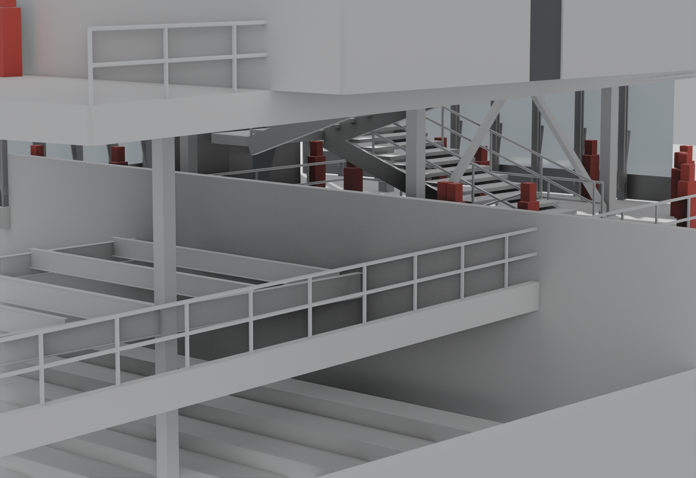

# Current model visual recheck

Version `20260904T234614Z-v3.4.0-d7cb03bc14a1-98b0ba3b0a89` · model
`building-v3-5b3193b619f5` · run `run-71898346b80c`.

All five Blender stills, the GLB, portable model, nine drawing previews, and run reports
match one immutable archive. The five views show the same bar-podium theater with a
High-Tech envelope; no historical or classical-looking model appears in this set.

## Findings

| Status | Finding | Evidence |
|---|---|---|
| passed within measured scope | No invalid plan ring, stair/slab intersection, stair/shaft intersection, inter-core stair collision, or program-zone overlap; all 8 floor landings meet their slabs at the same elevation | archived `contracts/visual_geometry_measurement.json` |
| review required | Diagonal frame members remain visually crowded against the stair flight in the structure close-up; the current measurement does not evaluate brace-to-stair volume | immutable Blender still above |
| failed | L01 provides 3 exits where the model reports 4 required, and 7,882 mm of stair width against 12,692 mm demand | current life-safety report |
| failed | L04 provides 1 exit where the model reports 2 required | current life-safety report |
| failed | 11 partition/void conflicts remain; the worst partition stands 67% inside an L02 floor void | current spatial report |
| unevaluated | 31 stair treads have no computed overhead obstacle in the limited head-clearance measurement | current visual-geometry measurement |

The Blender files remain `presentation_only`. The current Rhino slot is `blocked` because
no `.3dm` with the exact run/model/hash acceptance sidecar exists. This version cannot be
used as the issued Rhino/Revit source until that pair is published.
