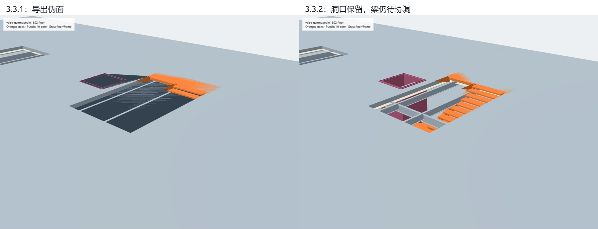

# 20 首音乐建筑视觉审计

2026-09-03—04 · 最终复测：compiler 3.3.2

20 首输入全部完成最终 v3 生成与逐曲视觉复核。修复了楼板/吊顶堵梯、电梯井侵入梯段、多个楼梯核心互穿、曲线楼板自交、GLB 填洞伪面及 v2 失败阻断 v3 共六类问题。**20 个模型均保留待解决项，不能据此认定可使用、可施工或规范通过。**

**版本范围：** 本报告中的图片属于 2026-09-03 冻结视觉实验，只用于这次审计。`baseline-frozen`、`after-frozen` 和 `final-frozen` 是被否决的负面证据；`verified-frozen` 是该实验的最终快照，也不代表项目当前模型。项目当前证据只由 [`model_versions/latest.json`](../../artifacts/model_versions/latest.json) 指向，Rhino 与 Blender 的权限状态以该版本清单为准。

初轮 20 次尝试中，19 个生成模型，Drozerix 在 v2 导出阶段中断；最终 20 个均生成 v3。正式几何前后比较采用这 19 个共同样本，Drozerix 单列为失败恢复案例。中间两轮虽然导出成功，仍被实际网格和视觉检查否决。

输入与方法

- 18 首 Kevin MacLeod 的 CC BY 4.0 录音，2 首来源页声明 CC0 的录音；保留作者、逐曲来源、许可和音频 SHA256。[曲库及来源](../../artifacts/visual_audit/2026-09-03/corpus_table.md) · [完整署名与许可说明](visual_music_corpus_20_license.md) · [机器清单](visual_music_corpus_20.json)。18 首署名授权录音使用时仍需署名。
- 每次输入使用整个下载文件。Couperin 来源本身是约 32.8 秒的公开录音节选；其余为来源发布的完整录音文件。未把节选称为完整作品。许可依据是链接来源的明确声明，未采用权利来源含糊的候选。
- 调用真实 `pipeline.compile_generation(..., render=True)`，经过音频、score、设计选择、编译、既有 Blender 无界面导出链。使用冻结源代码归档隔离同时进行的绘图工作；没有针对这 20 首调整音乐阈值或增加风格。
- 每个最终模型实际查看五个整体/结构视角，以及主楼梯 L02 俯视和剖切，共 **140 个视图**。原始渲染 100 张，实际 GLB 近景 40 张。橙色为楼梯，紫色为井道，灰色为楼板与结构。
- 视觉判断后以独立几何检查定位，再用实际 GLB 水平三角面和源多边形的并集比较复核导出。每个模型的楼板、吊顶各一次，**40/40 表面积一致检查通过**。范围不包括所有立面、节点或梁实体。

问题表

P1：影响交通、空间有效性或证据可靠性；P2：表面表达与几何归属问题。

| 编号 | 优先级 | 问题 | 根因与已做修改 | 复测结论 / 余项 |
|---|---|---|---|---|
| G1 | P1 | 楼梯穿过楼板与吊顶 | 楼梯生成与楼板开洞各自计算，楼板没有避让梯段。 楼梯、楼板、吊顶与空间预留共用 core layout；精确扣除洞口。 | **已修复并复测**。结构梁的避让仍属 G7。 |
| G2 | P1 | 电梯井侵入梯段 | 井道与楼梯共享锚点，井道尺寸跟随楼梯宽度。 独立搜索楼梯四侧的井道位置；采用明确的井道尺寸并验证避让。 | **已修复并复测**。门、设备和服务覆盖属 G8。 |
| G3 | P1 | 多个楼梯核心互穿 | 候选点没有排除其他核心的完整占地。 用包含平台的完整核心占地做互斥；实际梯段另行检查。 | **已修复并复测**。不从零碰撞推导疏散合格。 |
| G4 | P1 | 半圆端部楼板自交 | 西侧弧线的遍历方向与外边界不连续，形成跨越闭合边。 在 datum 源头纠正弧线顺序；非法多边形继续报错。 | **已修复并复测**。未用自动修补掩盖源几何错误。 |
| G5 | P1 | 源数据有洞，GLB 出现填洞伪面 | 环方向约定不一致；统一方向后，多个孔洞的最近顶点桥接仍会生成伪面。 把扣洞后的材料区域分解为无孔简单多边形；验证并集与原区域一致，再独立比较导出网格表面。 | **已修复并复测**。3.3.0 与 3.3.1 保留为失败证据；网格检查仅针对楼板和吊顶表面。 |
| G6 | P1 | v2 预览失败阻断 v3 审查 | Drozerix 的 v2 预览对象数为 550，超过现有 500 上限，异常提前终止共同流程。 保留 v2 错误和 blocked 状态，让独立的 v3 流程继续；前端处理缺失的 v2 资产。 | **已隔离并复测**。未抬高上限，未把缺失资产或 Rhino 接受状态写成通过。 |
| G7 | P1 | 梁占用楼梯与井道空间 | 结构梁仍按原轴网生成，尚未消费交通核心的三维净空需求。 新增几何净空检查和显式限制，保留构件供复核。 | **仍未解决**。需要洞口边梁、转换与节点方案，以及相应荷载重算；当前未切掉梁来隐藏冲突。 |
| G8 | P1 | 井体未证明可用电梯及完整顶层空间 | 现有模型只有井体，缺门、设备与顶部余量设计；布局的 served 列表与实发井段覆盖口径不同。 审计额外逐层列出实发井段；不以布局宣称或楼梯覆盖替代电梯覆盖。 | **仍未解决**。Raw 的井体止于 L06 楼面，缺该层以上井段；编译器文字仍未反映这一差异。全部模型缺电梯门、设备和可用服务验证。 |
| G9 | P2 | 平台与楼板共面条纹 | 齐平平台与楼板局部重叠，彩色检查材质下出现共面深度竞争。 保留齐平和接触检查，没有用高差遮掩条纹。 | **仍未解决**。后续需统一面归属与连接细节，避免重复表面和重复计量。 |
| G10 | P1 | 局部几何改善仍未满足完整使用要求 | 部分空间无法落位，疏散数量、容量、无障碍或构造检查仍有失败或未评估项。 保留未放置空间、未服务楼层、独立疏散报告与 unknown 状态。 | **仍未解决**。没有把模型可显示或楼梯接层升级为可使用、可施工或规范通过。 |

实际导出反例

Valse 的 3.3.1 源数据已经没有本审计记录的楼板碰撞，导出的楼板却仍封住梯洞。这个反例促成第二次修正：先把扣洞后的材料区域分解为无孔简单多边形，再交给既有导出器。保留全部材料区域，检查并集相等与零面积重叠。



左：3.3.1 的导出伪面。右：3.3.2 的洞口已保留，灰梁仍需要协调。共面橙色条纹也保留为 G9。图片是实际模型截图。

逐曲结果

下表“初轮”列为视觉记录及源几何定位编号；最终各行均已查看七个视图。G7? 表示该组视图只支持待核查，未直接确认梁侵入。所有行另有 G8（门、设备和可用服务未验证）、G10（其余使用与规范检查未闭合）；额外列出明确未落位的空间和 Raw 顶层井段。

| 曲目 / 风格 | 生成体量 | 初轮问题 | 最终仍见 / 额外未解决项 | 查看 |
|---|---|---|---|---|
| L'Art de toucher le clavecin (recorded excerpt) / Baroque harpsichord | 基座＋条形上部 | G1, G2, G3 | G7, G9 | [整体](../../artifacts/visual_audit/2026-09-03/verified-frozen/review_cards/couperin-harpsichord.jpg) · [剖切](../../artifacts/visual_audit/2026-09-03/verified-frozen/detail_cards/couperin-harpsichord.jpg) · [数据](../../artifacts/visual_audit/2026-09-03/verified-frozen/tracks/couperin-harpsichord/geometry_measurements.json) |
| Carefree / Contemporary ukulele / light pop | 板式 | G1, G2, G4 | G7, G9 | [整体](../../artifacts/visual_audit/2026-09-03/verified-frozen/review_cards/carefree.jpg) · [剖切](../../artifacts/visual_audit/2026-09-03/verified-frozen/detail_cards/carefree.jpg) · [数据](../../artifacts/visual_audit/2026-09-03/verified-frozen/tracks/carefree/geometry_measurements.json) |
| 4 RNDD! / Tracker chiptune / computer music | 板式 | P1 | G7, G9 | [整体](../../artifacts/visual_audit/2026-09-03/verified-frozen/review_cards/drozerix-rndd.jpg) · [剖切](../../artifacts/visual_audit/2026-09-03/verified-frozen/detail_cards/drozerix-rndd.jpg) · [数据](../../artifacts/visual_audit/2026-09-03/verified-frozen/tracks/drozerix-rndd/geometry_measurements.json) |
| Tafi Maradi / African percussion / call-and-response | 板式 | G1, G4 | G7, G9 | [整体](../../artifacts/visual_audit/2026-09-03/verified-frozen/review_cards/tafi-maradi.jpg) · [剖切](../../artifacts/visual_audit/2026-09-03/verified-frozen/detail_cards/tafi-maradi.jpg) · [数据](../../artifacts/visual_audit/2026-09-03/verified-frozen/tracks/tafi-maradi/geometry_measurements.json) |
| Cantina Blues / Blues / voice and saz | 基座＋条形上部 | G1, G2, G3 | G7, G9 | [整体](../../artifacts/visual_audit/2026-09-03/verified-frozen/review_cards/cantina-blues.jpg) · [剖切](../../artifacts/visual_audit/2026-09-03/verified-frozen/detail_cards/cantina-blues.jpg) · [数据](../../artifacts/visual_audit/2026-09-03/verified-frozen/tracks/cantina-blues/geometry_measurements.json) |
| Valse Gymnopedie / Classical piano with a modern beat | 基座＋条形上部 | G1, G2 | G7, G9；未落位：观众厅、舞台 | [整体](../../artifacts/visual_audit/2026-09-03/verified-frozen/review_cards/valse-gymnopedie.jpg) · [剖切](../../artifacts/visual_audit/2026-09-03/verified-frozen/detail_cards/valse-gymnopedie.jpg) · [数据](../../artifacts/visual_audit/2026-09-03/verified-frozen/tracks/valse-gymnopedie/geometry_measurements.json) |
| Funky Boxstep / Funk / off-kilter dance | 基座＋条形上部 | G1, G2, G3 | G7, G9 | [整体](../../artifacts/visual_audit/2026-09-03/verified-frozen/review_cards/funky-boxstep.jpg) · [剖切](../../artifacts/visual_audit/2026-09-03/verified-frozen/detail_cards/funky-boxstep.jpg) · [数据](../../artifacts/visual_audit/2026-09-03/verified-frozen/tracks/funky-boxstep/geometry_measurements.json) |
| Cloud Dancer / EDM / synthwave | 板式 | G1, G2, G4 | G7, G9 | [整体](../../artifacts/visual_audit/2026-09-03/verified-frozen/review_cards/cloud-dancer.jpg) · [剖切](../../artifacts/visual_audit/2026-09-03/verified-frozen/detail_cards/cloud-dancer.jpg) · [数据](../../artifacts/visual_audit/2026-09-03/verified-frozen/tracks/cloud-dancer/geometry_measurements.json) |
| Night in Venice / Jazz / saxophone lounge | 板式 | G1, G2, G4 | G7?, G9；未落位：两间展厅 | [整体](../../artifacts/visual_audit/2026-09-03/verified-frozen/review_cards/night-in-venice.jpg) · [剖切](../../artifacts/visual_audit/2026-09-03/verified-frozen/detail_cards/night-in-venice.jpg) · [数据](../../artifacts/visual_audit/2026-09-03/verified-frozen/tracks/night-in-venice/geometry_measurements.json) |
| BossaBossa / Brazilian bossa nova | 板式 | G1, G2, G4 | G7, G9 | [整体](../../artifacts/visual_audit/2026-09-03/verified-frozen/review_cards/bossa-bossa.jpg) · [剖切](../../artifacts/visual_audit/2026-09-03/verified-frozen/detail_cards/bossa-bossa.jpg) · [数据](../../artifacts/visual_audit/2026-09-03/verified-frozen/tracks/bossa-bossa/geometry_measurements.json) |
| Dub Eastern / Reggae dub / electronic fusion | 基座＋条形上部 | G1, G2, G3 | G7, G9 | [整体](../../artifacts/visual_audit/2026-09-03/verified-frozen/review_cards/dub-eastern.jpg) · [剖切](../../artifacts/visual_audit/2026-09-03/verified-frozen/detail_cards/dub-eastern.jpg) · [数据](../../artifacts/visual_audit/2026-09-03/verified-frozen/tracks/dub-eastern/geometry_measurements.json) |
| Raw / Raw low-bass rock | 基座＋条形上部 | G1, G2 | G7, G9；井体止于 L06 楼面，缺上方井段 | [整体](../../artifacts/visual_audit/2026-09-03/verified-frozen/review_cards/raw.jpg) · [剖切](../../artifacts/visual_audit/2026-09-03/verified-frozen/detail_cards/raw.jpg) · [数据](../../artifacts/visual_audit/2026-09-03/verified-frozen/tracks/raw/geometry_measurements.json) |
| Blue Ska / Ska / brass dance | 板式 | G1, G2, G4 | G7, G9 | [整体](../../artifacts/visual_audit/2026-09-03/verified-frozen/review_cards/blue-ska.jpg) · [剖切](../../artifacts/visual_audit/2026-09-03/verified-frozen/detail_cards/blue-ska.jpg) · [数据](../../artifacts/visual_audit/2026-09-03/verified-frozen/tracks/blue-ska/geometry_measurements.json) |
| The Britons / Medieval / tavern soundtrack | 亭式 | G1, G2, G4 | G7, G9 | [整体](../../artifacts/visual_audit/2026-09-03/verified-frozen/review_cards/the-britons.jpg) · [剖切](../../artifacts/visual_audit/2026-09-03/verified-frozen/detail_cards/the-britons.jpg) · [数据](../../artifacts/visual_audit/2026-09-03/verified-frozen/tracks/the-britons/geometry_measurements.json) |
| Still Pickin / Bluegrass / folk picking | 板式 | G1, G2, G4 | G7, G9 | [整体](../../artifacts/visual_audit/2026-09-03/verified-frozen/review_cards/still-pickin.jpg) · [剖切](../../artifacts/visual_audit/2026-09-03/verified-frozen/detail_cards/still-pickin.jpg) · [数据](../../artifacts/visual_audit/2026-09-03/verified-frozen/tracks/still-pickin/geometry_measurements.json) |
| Exotic Battle / Cinematic orchestral / African-influenced | 板式 | G1, G2, G4 | G7, G9 | [整体](../../artifacts/visual_audit/2026-09-03/verified-frozen/review_cards/exotic-battle.jpg) · [剖切](../../artifacts/visual_audit/2026-09-03/verified-frozen/detail_cards/exotic-battle.jpg) · [数据](../../artifacts/visual_audit/2026-09-03/verified-frozen/tracks/exotic-battle/geometry_measurements.json) |
| Dama-May / Asynchronous autoharp / experimental folk | 板式 | G1, G2, G4 | G7, G9 | [整体](../../artifacts/visual_audit/2026-09-03/verified-frozen/review_cards/dama-may.jpg) · [剖切](../../artifacts/visual_audit/2026-09-03/verified-frozen/detail_cards/dama-may.jpg) · [数据](../../artifacts/visual_audit/2026-09-03/verified-frozen/tracks/dama-may/geometry_measurements.json) |
| SCP-x5x (Outer Thoughts) / Horror piano / dark score | 基座＋条形上部 | G1, G2, G3 | G7, G9；未落位：观众厅、舞台 | [整体](../../artifacts/visual_audit/2026-09-03/verified-frozen/review_cards/scp-outer-thoughts.jpg) · [剖切](../../artifacts/visual_audit/2026-09-03/verified-frozen/detail_cards/scp-outer-thoughts.jpg) · [数据](../../artifacts/visual_audit/2026-09-03/verified-frozen/tracks/scp-outer-thoughts/geometry_measurements.json) |
| Android Sock Hop / Retro pop / synth rock | 板式 | G1, G2, G4 | G7, G9 | [整体](../../artifacts/visual_audit/2026-09-03/verified-frozen/review_cards/android-sock-hop.jpg) · [剖切](../../artifacts/visual_audit/2026-09-03/verified-frozen/detail_cards/android-sock-hop.jpg) · [数据](../../artifacts/visual_audit/2026-09-03/verified-frozen/tracks/android-sock-hop/geometry_measurements.json) |
| Ritual / Slow world flute / synth atmosphere | 基座＋条形上部 | G1, G2 | G7, G9；未落位：观众厅、舞台 | [整体](../../artifacts/visual_audit/2026-09-03/verified-frozen/review_cards/ritual.jpg) · [剖切](../../artifacts/visual_audit/2026-09-03/verified-frozen/detail_cards/ritual.jpg) · [数据](../../artifacts/visual_audit/2026-09-03/verified-frozen/tracks/ritual/geometry_measurements.json) |

可核对的测量结果

这些是检查记录数，包含不同构件对和多边形；不能当作独立的视觉缺陷数量。非法源几何、无可计算顶部障碍等仍列为未评估。楼板分片改变了构件对数量，因此不计算跨轮“碰撞下降百分比”。

| 检查 | 初轮发现 / 未评估（19 模型） | 最终发现 / 未评估（20 模型） |
|---|---:|---:|
| 边界自交或非法拓扑 | 162 / 0 | 0 / 0 |
| 楼梯顶部净空（限定几何） | 1527 / 4185 | 0 / 5430 |
| 踏步与楼板实体相交 | 212 / 348 | 0 / 0 |
| 踏步与井壁实体相交 | 1268 / 0 | 0 / 0 |
| 不同楼梯核心的踏步相交 | 170 / 0 | 0 / 0 |
| 程序分区正面积重叠 | 0 / 0 | 0 / 0 |
| 平台接层与楼板接触 | 0 / 174 | 0 / 0 |

最终完成 248,614 条有限范围的几何求值，记录的发现为 0，同时有 **5,430 条顶部净空检查未评估**。独立运行时空间报告另外保留 2,449 条顶部净空审查警告与 22 条子系统重叠警告；梁采用中心线包络近似，警告不升级为精确实体判决。视觉看到的 G7 因而没有被“零发现”掩盖。报告详情存在数量上限，汇总使用未截断计数。

250 个平台接触记录完成求值，无接层/接触失败；全部占用层均有内部楼梯平台记录。这只证明被测平台的几何关系，无法证明所有房间都能抵达、疏散容量充足或梯段净空合格。Raw 的最后一段井体从 L05 延伸至 L06 楼面，没有 L06 以上的井段；编译器的文字仍按布局服务列表判断，尚未反映这个几何口径差异。

4 首仍有共 8 个程序空间无法放置：Night in Venice 的两间展厅，以及 Valse、SCP-x5x、Ritual 各自的观众厅和舞台。没有缩小它们来制造分配成功。

整体视图未确认整层楼板悬浮。构造连接、局部隐藏构件、全部房间内部和承载能力未由这些视角穷尽验证；不能用该观察推导“没有悬浮部件”。

覆盖范围也有限：这 20 首产生 11 个板式、8 个基座＋条形上部、1 个亭式；用途为 6 图书馆、12 剧场、1 博物馆、1 亭；最终全部采用钢框架，立面语法为 11 International Style、2 Organic、7 Critical Regionalism。测试揭示了当前可执行域的集中性，不能宣称覆盖全部体量、结构或风格。七种体量的楼梯接层另由合成测试覆盖。

架构优化与验证

1. 统一交通核心决策。完整楼梯占地包含平台；楼梯、洞口、空间预留和井道消费同一布局，体量切除先于布局。无合法位置时记录无法服务的楼层。
2. 把平面材料区域处理放在便携模块 `plan_regions.py`，修复 datum 源头错误；从源几何到网格保留独立验证。Blender 导入器没有被改写来偷偷修补设计。
3. 将运行时几何审查和独立审计脚本分开；缺输入、非法拓扑和近似几何保留 unknown。平台接触合并同层齐平楼板分片，重叠仅计一次。
4. 隔离 v2 预览异常。Drozerix 仍明确记录 550 个预览对象超过现有 500 上限，v3 完成；缺失 v2 资产保持空值和 blocked。未提高对象上限，未升级 Rhino 接受状态。

后续首要工作是让结构生成器消费交通三维净空，形成洞口边梁、转换和节点方案并重算荷载；其次闭合井道顶部空间、门与设备，再处理平台与楼板的面归属。简单删除相撞梁会破坏受力路径，因此当前保留冲突及审查记录。

验证记录见 [测试日志](../../artifacts/visual_audit/2026-09-03/targeted_test_results.txt)：3.3.2 的交通/边界测试 19 项通过；几何审查、v2 隔离与 integration 16 项通过；GLB parity 与几何审查 21 项通过，其中有重复用例，不能相加为独立测试总数。接触测量与几何审查共 12 项通过，覆盖相邻分片、非法分片和竖向错位。七种体量接层测试在分片修正前通过，分片后重跑了保持区域并集的定向测试。未声称运行完整后端测试套件。

v3 demo 和浏览器冻结 demo 均已按 3.3.2 重新生成；18 个独立资源引用存在，两个模型的资产及 manifest 共 4 个哈希匹配。保留 demo 原有失败和未评估状态，未删除其他模型资产。

证据与复现

- [验证清单](../../artifacts/visual_audit/2026-09-03/verification.json)：20 个保留音频哈希、140 个原始模型/渲染文件哈希均匹配；另有 40 张 GLB 近景。实际人工视觉记录在 [visual_review.json](../../artifacts/visual_audit/2026-09-03/verified-frozen/visual_review.json)；生成时 result 中的 pending 是导出瞬间的状态快照。
- [初轮测量](../../artifacts/visual_audit/2026-09-03/baseline-frozen/measurement_summary.json) · [最终测量](../../artifacts/visual_audit/2026-09-03/verified-frozen/measurement_summary.json) · [实际 GLB parity](../../artifacts/visual_audit/2026-09-03/verified-frozen/glb_parity_report.json) · [逐曲 CSV](../../artifacts/visual_audit/2026-09-03/case_results.csv) · [问题目录 JSON](../../artifacts/visual_audit/2026-09-03/issue_catalog.json)。
- [源代码差异边界](../../artifacts/visual_audit/2026-09-03/source_comparison.json) 记录正式前后版本。源代码快照、`after-frozen`（3.3.0）和 `final-frozen`（3.3.1）保留在本机审计目录；两轮中间结果均被否决。公开仓库保留最终对照卡与测量 JSON。
- 共同完成的 19 首中，18 首的完整音频特征与 score 序列化哈希完全相同；Valse 的路径迁移改变文件名元数据，数值和源音频仍相同。Drozerix 初轮无响应，不能参与该特征对比。
- 音频、完整 GLB 与逐视图渲染保留在本机 `artifacts/visual_audit/2026-09-03/` 并由 Git 忽略；公开仓库保留对照卡、测量 JSON、汇总和哈希。审计 native Blender 临时文件未作为交付保留。
- Blender 无界面文件工作流仅提供下游展示证据；本次未通过 GUI MCP 操作，也未改变 Rhino 接受的设计权威。

运行新批次时，使用新输出目录；对已有冻结目录只做读入或独立测量。完整再生会调用既有 Blender 导出器：

```powershell
.venv/Scripts/python.exe backend/scripts/run_visual_music_audit.py --manifest docs/experiments/visual_music_corpus_20.json --output artifacts/visual_audit/new-run
.venv/Scripts/python.exe backend/scripts/summarize_visual_music_audit.py artifacts/visual_audit/new-run --compare-dir artifacts/visual_audit/2026-09-03/baseline-frozen
```

该证据对应 V2 系统协调、V3 故障隔离与可复现流程、V4 对实际结果的独立评估；未完成的建筑问题没有被证据统计转写为通过。

临时清理：浏览器审查会话与临时 HTTP 服务已关闭。任务临时目录仍保留在本机并由 Git 忽略；这些副本与辅助初测目录不属于正式 20 首结果。公开证据均使用上方链接。
