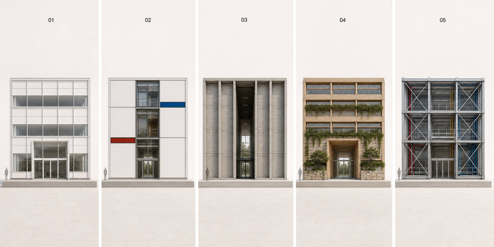
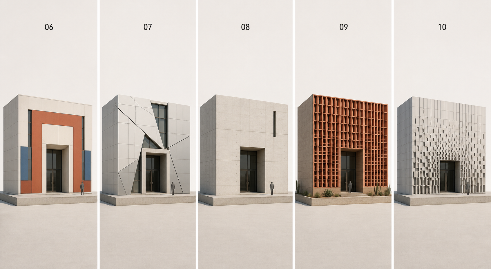

# Cube Entry Facade Concept Study

This folder demonstrates how manually authored entry scores could be interpreted by the
ten facade research guides while keeping a 12 × 12 × 12 m cube constant.

The score fixture is `cube_entry_score_examples.yaml`. All values use `method: manual`
and `confidence: 1.0`; no value is presented as an MP3 measurement.
The exact built-in image-generation prompts are recorded in `imagegen_prompts.md`.

## Visual sheets

Left to right: International Style–informed, Bauhaus-informed,
Brutalism-informed, Organic Architecture–informed, and High-tech–informed.

Left to right: Postmodernism-informed, Deconstructivism-informed,
Minimalism-informed, Critical Regionalism climate-response placeholder, and
Parametricism-informed.

The rendered sheets are concept illustrations created from the written grammar. They are
not Grasshopper/Rhino compiler output, accepted geometry, or proof that the ten grammars
have been implemented. Their purpose is to support visual discussion before selecting
the first two executable grammars.

Critical Regionalism remains blocked under the full guide. Its image is only a
climate-response placeholder using an assumed Los Angeles hot-dry test condition and
lacks the material, craft and cultural evidence required for a passing grammar.

## Interpretation cautions

- The two sheets hold the cube and general presentation setup constant, but image
  generation cannot guarantee dimensionally identical cameras or construction geometry.
- The images show intended visual direction. The YAML record is the authoritative source
  for the manually authored score values and entry mappings in this concept study.
- A future executable comparison should rebuild the same fixture in Grasshopper/Rhino,
  apply the grammar validators, and render only accepted geometry in Blender.
